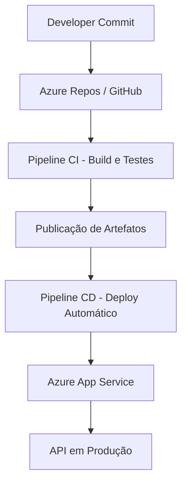

# ☁️ TrackZone Cloud API – Deploy e CI/CD no Azure

## 🚀 Sprint 4 – Cloud Computing & DevOps

### 👨‍🏫 Professor
Projeto para entrega da **Sprint 4** da disciplina **DevOps Tools & Cloud Computing**.

**Integrantes do Grupo:**  
- RM554764 – André Antunes – 2TDSA  

**Repositório do Azure DevOps:**  
🔗 [https://dev.azure.com/RM554764/challenge/_git/cloud-net-challenge4](https://dev.azure.com/RM554764/challenge/_git/cloud-net-challenge4)

---

## 1️⃣ Descrição da Solução

O **TrackZone Cloud API** é uma aplicação **.NET 9 + ASP.NET Core Web API** voltada para o **gerenciamento de motos** (rastreamento, operações e status), agora totalmente integrada a um **pipeline de CI/CD no Azure DevOps**, com **deploy automatizado em ambiente de nuvem Azure App Service**.

A solução aplica práticas de **DevOps** e **Cloud Computing** para garantir **disponibilidade, escalabilidade e entrega contínua**.

---

## 2️⃣ Arquitetura da Solução



**Principais Tecnologias:**
- .NET 9 (C#)
- Azure DevOps (Pipelines YAML)
- Azure App Service (Web App for Containers)
- Docker (Containerização)
- Git (Controle de versão)
- SQL Server (Banco hospedado na nuvem)

---

## 3️⃣ Estrutura do Pipeline

### 📦 Fase 1 – CI (Integração Contínua)
- Executa build do projeto com `dotnet build`
- Roda testes automatizados (`dotnet test`)
- Publica artefatos no Azure DevOps

### ☁️ Fase 2 – CD (Entrega Contínua)
- Baixa os artefatos publicados
- Realiza o deploy no Azure App Service
- Atualiza a versão em produção automaticamente

---

## 4️⃣ Execução Local

### 🔧 Pré-requisitos
- [.NET SDK 9.0](https://dotnet.microsoft.com/)
- [Docker Desktop](https://www.docker.com/)
- [Azure CLI](https://learn.microsoft.com/en-us/cli/azure/)

### ▶️ Rodando o projeto localmente
```bash
# Clonar o repositório
git clone https://dev.azure.com/RM554764/challenge/_git/cloud-net-challenge4

# Entrar no diretório
cd cloud-net-challenge4

# Executar o build
dotnet build

# Rodar a API
dotnet run
```

A aplicação ficará disponível em:  
👉 `http://localhost:5000/swagger`

---

## 5️⃣ Deploy na Nuvem (Azure)

O pipeline YAML realiza o deploy automático no **Azure App Service** após o merge na branch `main`.  
As credenciais e permissões são configuradas via **Service Connection** no Azure DevOps.

Exemplo de trecho do `azure-pipelines.yml`:

```yaml
trigger:
  branches:
    include:
      - main

pool:
  vmImage: 'ubuntu-latest'

steps:
- task: UseDotNet@2
  inputs:
    packageType: 'sdk'
    version: '9.x'

- script: dotnet build --configuration Release
  displayName: 'Build do projeto'

- script: dotnet test
  displayName: 'Executar testes'

- task: DotNetCoreCLI@2
  inputs:
    command: 'publish'
    publishWebProjects: true
    arguments: '--configuration Release --output $(Build.ArtifactStagingDirectory)'
    zipAfterPublish: true

- task: AzureWebApp@1
  inputs:
    azureSubscription: 'ServiceConnection-AzureTrackZone'
    appName: 'trackzone-api-cloud'
    package: '$(Build.ArtifactStagingDirectory)/**/*.zip'
```

---

## 6️⃣ Resultados e Benefícios

✅ Pipeline 100% automatizado (Build, Test e Deploy)  
✅ Entregas contínuas e seguras via Azure DevOps  
✅ Monitoramento de logs e métricas pelo Azure Portal  
✅ Redução de tempo de deploy e falhas humanas  
✅ Escalabilidade e alta disponibilidade na nuvem Azure  

---

## 🧠 Conclusão

A implementação do **TrackZone Cloud API** demonstra o domínio dos conceitos de **DevOps e Cloud Computing**, integrando uma aplicação real a pipelines CI/CD automatizados com **Azure DevOps** e **Azure App Service**, promovendo um ciclo de entrega ágil, seguro e sustentável.

---

## 📄 Licença
Este projeto é de uso acadêmico para fins de demonstração na **FIAP – Sprint 4**.
